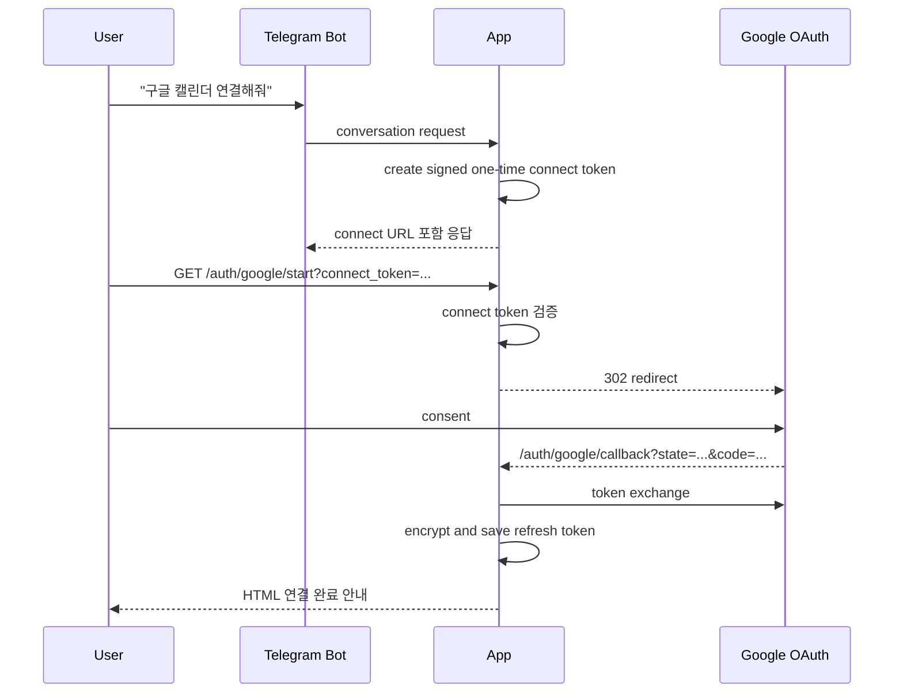
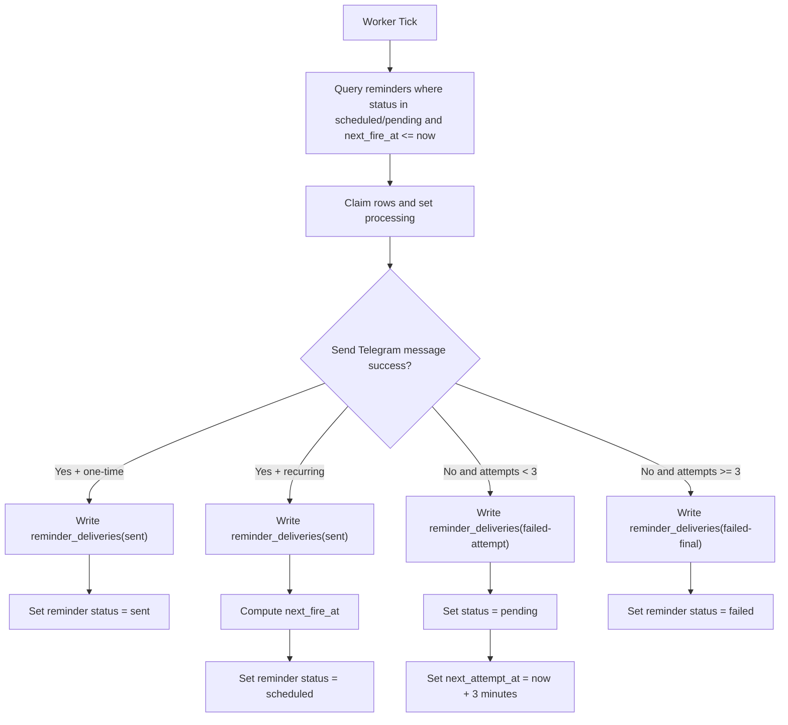
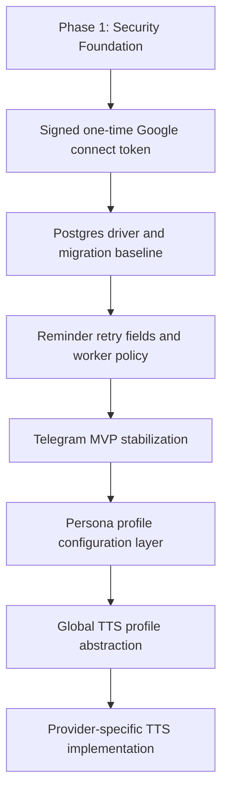
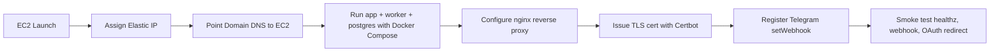

# Workflow

## 1. 사용자 대화 처리 순서도

```mermaid
flowchart LR
    A["Telegram User Message"] --> B["Nginx HTTPS Webhook"]
    B --> C["FastAPI /webhooks/telegram/{webhook_key}"]
    C --> D["TelegramAdapter.parse_update"]
    D --> E["ConversationService.handle_event"]
    E --> F["Load/Create InternalUser"]
    F --> G["Store inbound message + idempotency check"]
    G --> H["Build prompt: system + summary + recent turns"]
    H --> I["OpenAI Responses API"]
    I --> J{"Tool call exists?"}
    J -- "No" --> K["Store assistant message"]
    J -- "Yes" --> L["ToolRouter.execute"]
    L --> M["ReminderService / GoogleOAuthService"]
    M --> N["Store tool result"]
    N --> O["Submit function_call_output to model"]
    O --> J
    K --> P["Refresh conversation summary if needed"]
    P --> Q["TelegramAdapter.send_message"]
    Q --> R["User receives reply"]
```

## 2. Google OAuth 연결 순서도

## 3. Reminder 발송 및 재시도 순서도

## 4. 구현 작업 순서도

## 5. 운영 배포 순서도

## 6. 핵심 운영 규칙
- Telegram은 webhook only
- HTTPS는 nginx + Certbot 조합
- reminder retry는 3분 간격 3회
- TTS는 마지막 단계에서 global profile 기준으로 추가
- Discord는 adapter만 추가하는 방식으로 확장
